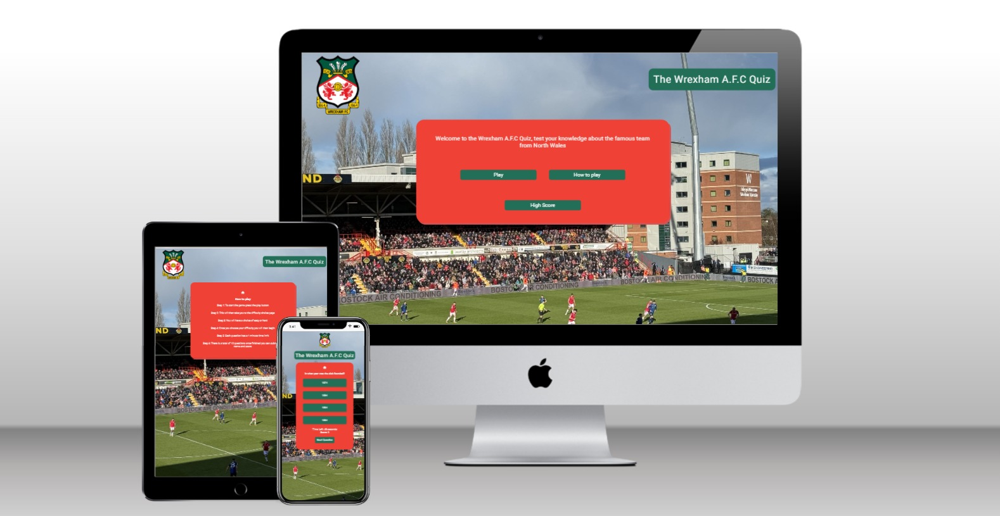
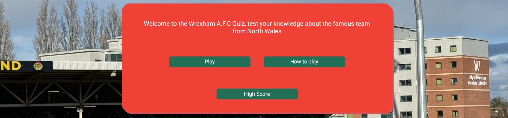
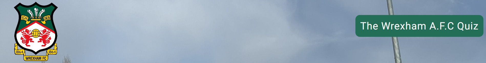
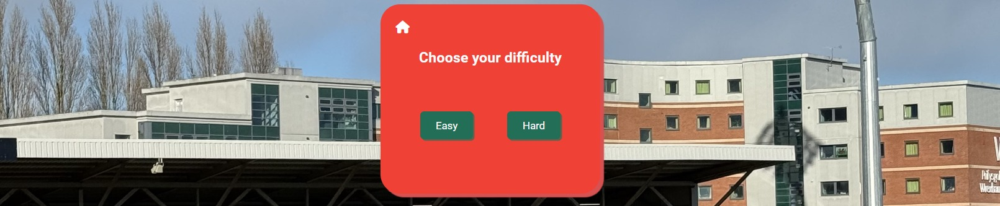
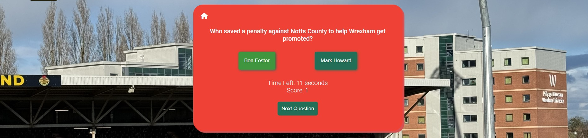
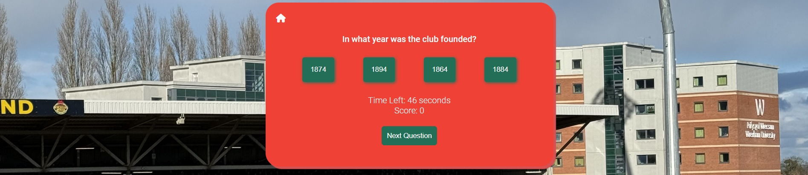
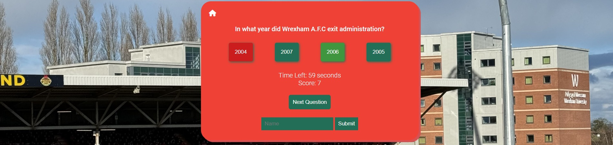
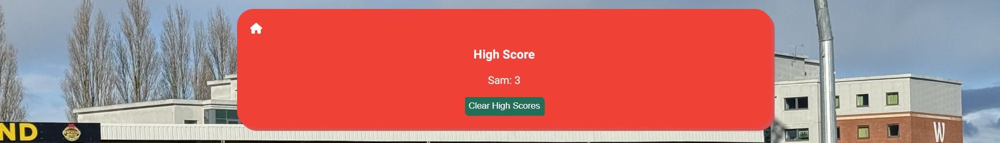
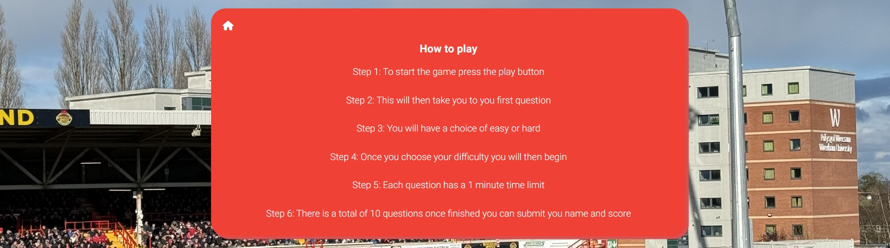

# The Wrexham A.F.C Quiz

The purpose of this website is to test peoples knowledge of Wrexham Football Club in the 2023/2024 season. The site is aimed at people who are already familiar and who are fans of the club and want to test how much they know about it. The website allows the users to submit their scores to a high score page so they can play with their friends. 

## Features 
* Home page
    * The home page includes 3 different buttons for the user to choose from, play, how to play and highscores.
    * The home page is accessible from every other page using the home button. 
    

* Header 
    * The header is simple with the quiz title and the football clubs badge, the badge is also a link to the home page. 
    

* Difficulty page
    * This page is accessed when the user clicks play on the home page.
    * This page gives the user to options either easy or hard, and also a home button to return to the home page. This button is accessible on all pages apart from the home page. 
    

* Easy quiz question page
    * The user is shown a question and will be given two answers to choose from, they have a one minute time limit to answer this question.
    * A next question button will be underneath the answers and can be clicked to move onto the next question. 
   

* Hard quiz question page
    * Similar to the easy questiion page but the questions are harder and there is now a choice of four questions instead of two. 
    

* Submit high scores form
    * This form appears after the user has been through all the questions, the user can submit their name and submit their score to the highscore page. 
    

* High score page
    * On this page the users can see all their highscores they have submitted and they can also clear the highscores page user the the clear highscores button.
    

* How to play
    * This is where the user can come if they are unsure on how to play the game and it gives them a step by step guide. 

### Game Buttons 
#### Home page
* The play button
    * This is the button the user will press if they want to go straight into the game.
* How to play
    * This button is for users who would like to know how to play the game
* Highscore button
    * Takes the user to the highscores page to see their previous scores
#### Difficulty page
* Easy button
    * Takes the user through to the easy questions
* Hard button
    * Takes the user through to the hard questions

#### Quiz page
* Answers 
    * There will be two or four answers visible for users to click on depending on the difficulty
* Next Question
    * This button allows users to go to the next question
* Submit
    * This button appears at the end of the quiz when all ten questions are answered

#### High score page
* Clear high scores button
    * Allows user to clear all previous high scores that have been submitted

## User Experience

### First time visitors
* As a first time visitor I want to learn how to play the game, they will do this by entering the how to play page.
* I should easily be able to begin the game and select a difficulty of choice. 
* I will be able to gain knowledge and not just play the game so when I return I will improve if I try to play again. 

### Second time visitors
* On the second visit I will be able to go straight into the game without needing to look how to play.
* I will feel more confident and will want to try the harder level as I found the easy level to easy.
* I want to be able to compare my scores with my friends, so we can compete against eachother.  

### Difficulty modes
* Easy mode
    * The easy mode only has a 50/50 choice so there is less chance of getting the answer wrong, also the questions are slightly easier. Difficulty is selected before entering the quiz page. 

* Hard Mode
    * This mode is harder as it has 4 different answers to choose from, but also the questions will be slightly harder. If the player selects the correct answer it will light up green, if they select the wrong answer it will light up red and the correct answer will light up green, the purpose of this is allow the user to learn whilst playing the game. 

### Design Choices
* Colour Scheme
    * The two main colours used were red (#ef4136) and green (#226e57). These colours were chosen as they are the main colours associated with Wrexham AFC. White was used for the text as it makes it more appealing. 
* Typography
    * The font used was Roboto, with sans-serif set as a back up font. Roboto was used as it has an easy readibility and has a clean and modern design. 
* Imagery
    * The background image used was taken at the Wrexham AFC home ground and makes for a well suited background image. Also the Wrexham AFC badge was also added to follow the Wrexham theme. 

### Wireframes
* All wireframes were created using Balsamiq wireframes, all designs for desktop, tablet and mobile are linked [here](documentation/wireframes/milestone-project-2.png)
* Some changes were made, the quiz title was moved to the top of the screen and also a wrexham badge was added for a more stylish look. 

### Testing
* The W3C CSS validator and the W3C Markup Validator were used to validate every page of the project to make sure there were no syntax errors.

    * [W3C CSS Validator](https://jigsaw.w3.org/css-validator/#validate_by_input) [Result](documentation/css-validation.jpg)
    * [W3C Markup Validator](https://validator.w3.org/) - Results for each page are below
        * [Home page](documentation/index.html-valdidation.jpg)
        * [Difficulty page](documentation/difficulty-level.html-validation.jpg)
        * [Easy questions](documentation/easy-level.html-validation.jpg)
        * [Hard questions](documentation/hard-level.html-validation.jpg)
        * [High score page](documentation/highscore.html-validation.jpg)
        * [How to play page](documentation/how-to-play.html-validation.jpg)
    * [JSHint](https://jshint.com) - Results for each JavaScript file are below
        * [Quiz page](documentation/play.js-jshint-validation.jpg)
        * [Difficulty page](documentation/difficulty.js-jshint-validation.jpg)
        * [High score page](documentation/highscore.js-jshint-validation.jpg)

    * All webpages were tested using lighthouse and all performed to a passable level for performance, accessability, best practises and SEO for both mobile and desktop screen sizes. 

### Manual and Automated testing

* I have decided to stick with manual testing on this project, instead I asked users to test the website for me. It was tested on different browser sizes. I asked users to inform me if they could easily understand the game and felt like they could move through it easily and gain confidence and learn along the way. Their feedback is in the user stories testing. 

* I personally felt the project was to small to require automated testing. However if the project grew in size I would definitely implement it. 

### Testing User Stories

* First time visitor goals
    * As a first time visitor I want to learn how to play the game.
        * The user can easily do this by clicking on the how to play button on the home screen, this then takes them to the how to play page where they are shown clearly a step by step guide on how to play the game.
    * I should easily be able to play the game and choose a difficulty
        * When the user is ready to play the game they click the play button this takes them to the page where they can choose between easy or hard difficulty, when they click on either one they then move onto the quiz with the corresponding difficulty level questions. 
    * I want to be able to gain knowledge
        * The user gains knowledge on each question as they will be told the correct answer even if they choose the wrong one. Allowing them to learn as they play. 

* Second time visitor goals
    * I will be able to go straight into the game
        * As the player already knows how to play from their previous visit they can just go straight into the game. 
    * I will feel more confident and choose a harder difficulty level
        * As the user has gained knowledge from their previous visit as they foudn out the correct answers even if they answered them wrong. They will have more confidence to try the harder level.
    * I want to be able to compare my scores with my friends
        * Users can do this by either playing on the same device and going to the highscores page and looking at all of their scores. Or they can show eachother their scores on their own devices and compare, if they want to reset the scoreboard they can press the clear high score button. 

* Future visitor goals
    * The future plan is to add more than ten questions in each difficulty level and then pick ten different questions from random to add variety to the quiz. Also have two different leaderboards for each difficulty level. 

### Further testing
* A lot of testing was done to ensure all page content was clearly visible on different screen sizes, including phones tablets and desktop screen sizes. 
* The website was viewed in multiple different screen sizes using google chromes developer tools. 
* The website was viewed and tested in different web browsers (google chrome, safari, microsoft edge, firefox). 

### Manual Javascript testing
* The correct difficulty level is shown to the user depending on what button the user clicks (easy or hard).
* Once the difficulty is chosen the corresponding questions are shown to the user and the timer begins.
* If the user selects the correct answer the button turns green and the score is incremented by one. The buttons are also disabled when one answer is selected. This stops the user from being able to click on the correct answer after getting it wrong. 
* If the user clicks the wrong answer it turns red then the correct one is shown to them.
* The user can click on next question and it takes them to the next question. 
* Once all questions have been answered the user can click next question and a submit form is shown. They can enter their name and submit their score to the highscore page. 
* Scores show on the highscore page unless the user clears them using the clear high score button.
    * Here is a flow chart of how I wanted the game to work. [Flowchart](documentation/javascript-flow-chart.jpg)

## Bugs Found
* One bug found was when going down to small screens on the harder difficulty levels the buttons contents were not staying in the buttons and they were not staying central. To overcome this issue I changed the display to flex and added justify content to center and this worked. 

## Deployment 
* This site was deployed to github pages here are the steps:
    * In Github find the repository.
    * Then go to the repository settings tab.
    * In the code and automation section on the sidebar scroll down to pages.
    * in the pages section under the source select deploy from branch.
    * Then use the branch dropdown menu to select main instead of none.
    * Then select root in the dropdown tab next to main.
    * Once completed press save. 
  * The github pages link is here <https://samlarby.github.io/milestone-project-2/>

## Credits
### Image Credits
* The Wrexham Badge was taken from https://www.cleanpng.com/png-racecourse-ground-wrexham-a-f-c-national-league-ch-5009892/#google_vignette 
* The background image was taken by myself.
### Quiz Questions
* All quiz questions were written by myself but some question ideas were taken from https://letsquiz.com/quiz/wrexham-a-f-c-knowledge-showdown-show-us-what-you-ve-got
### Acknowledgements
* I would like to thanke my mentor for their support.
* Also thank you to the slack community. 
* Icons were taken from <https://fontawesome.com/>
* Font was from <https://fonts.google.com/>
* With help to create the quiz javascript I used, w3 schools, mdn web docs, previous content from code institute, sitepoint to help with basic structure. 